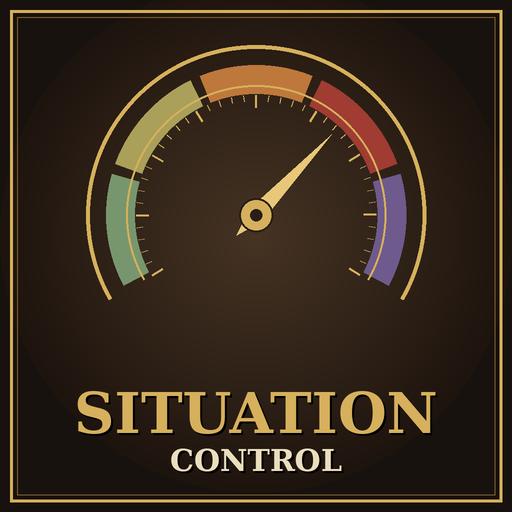

# Situation Control

A Crusader Kings III mod that lets you steer the game's great situations and struggles towards the phase you want, using the very same catalysts the game uses.

Supported: **The Christian Church**, the **Dynastic Cycle**, the **Iberian Struggle** and the **Iranian Intermezzo**.

- **Game version:** 1.20.x
- **Mod version:** 1.2.0
- **Languages:** English and Spanish (other game languages show the English texts)
- **Author:** [Sourenics](https://github.com/Sourenics)
- **Steam Workshop:** *link coming soon*

## Features

A new decision, **Situation Control**, opens a menu listing every situation active in your game:

1. Pick the phase you want to push towards. Only phases reachable from the current one are shown, with the points they need.
2. Pick an intensity: 1, 5, 10 or 25 activations per click.
3. Fire catalysts from a list sorted by strength, showing the exact points each one adds. Hover over an option to see whether it also affects other phases.

### Design principles

- **Only character-driven catalysts.** Every catalyst was checked against the game files to see where the game fires it. Wars, murders, appointments, excommunications, alliances, buildings and so on are included. Those fired by yearly checks, the state of the world, passive conversions, natural deaths, heresies or successions are left out.
- **No forced phases.** Phases change exactly as they would in a normal game, once the bar fills up.
- **Delicate mechanics are untouched.** The Great Schism still requires its own progress (13), the Investiture Controversy can only be left through its council, and the Mandate of Heaven is never touched.
- **The Investiture Controversy** can only be targeted when the game allows it: the main Christian faith must use Conditional clerical succession and have a Head of Faith.
- **Ending phases** (such as the Concession of the Iranian Intermezzo) are clearly marked and only happen if you choose them.

### Notifications

- **The Christian Church and the Dynastic Cycle** use a **silent mode** by default: the exact same points, without notifications. You can switch to real catalysts to record them in the situation history.
- **Struggles** always fire real catalysts. Their notifications go to a new **Situation Control** category in the Message Settings, hidden by default.

## Languages

- **English** and **Spanish**: all menu texts are translated.
- **French, German, Russian, Polish, Korean, Simplified Chinese and Japanese**: menu texts are shown in English.
- In every language, situation, phase and catalyst names come from the game's own localization, so they always appear in your game language.

Translations are welcome: open an issue or a pull request with the file for your language.

## Installation

### Steam Workshop

Subscribe on the Steam Workshop page and enable the mod in the Paradox launcher.

### Manual

1. Download this repository (green **Code** button → **Download ZIP**).
2. Copy the contents of the `mod/` folder (`situation_control/` and `situation_control.mod`) into:
   - **Windows:** `Documents/Paradox Interactive/Crusader Kings III/mod/`
   - **Linux:** `~/.local/share/Paradox Interactive/Crusader Kings III/mod/`
   - **macOS:** `~/Documents/Paradox Interactive/Crusader Kings III/mod/`
3. Enable **Situation Control** in the Paradox launcher.

## Compatibility

- Each situation only appears if its DLC is active and the situation exists in your game. No DLC is required to run the mod.
- Can be added to or removed from an existing save.
- Overrides one vanilla file, `common/messages/01_struggle_messages.txt`, with a single line changed to reroute catalyst notifications. Other mods that replace the same file may conflict.
- Achievements are disabled, as with any mod that changes the game checksum.

## Reporting bugs

Please open an [issue](../../issues/new/choose) using the **Bug report** template. To be able to fix the problem we need:

1. **The `error.log` file** from the session where the problem happened:
   - **Windows:** `Documents/Paradox Interactive/Crusader Kings III/logs/error.log`
   - **Linux:** `~/.local/share/Paradox Interactive/Crusader Kings III/logs/error.log`
   - **macOS:** `~/Documents/Paradox Interactive/Crusader Kings III/logs/error.log`

   The log is overwritten every time the game starts, so copy it right after the problem happens, before launching the game again. Ideally, reproduce the problem in a session with **only Situation Control enabled**.
2. **The game version** (shown in the main menu, for example 1.20.0.3) and **the mod version**.
3. **Your active DLCs** and **your full mod list in load order**.
4. **Which situation and phases** were involved (for example: The Christian Church, from Fragile Unity towards Concord).
5. **Steps to reproduce:** what you clicked and what happened, compared to what you expected.
6. **Screenshots**, if the problem is visual (wrong text, missing options, unexpected notifications).

## License

**Situation Control** © 2026 Sourenics, licensed under [Creative Commons Attribution-ShareAlike 4.0 International (CC BY-SA 4.0)](https://creativecommons.org/licenses/by-sa/4.0/).

Forks, translations and alternative versions are welcome, provided that you:

- **Credit the original author** (Sourenics) and link to this repository.
- **Indicate the changes** you made.
- **Release your version under the same license** (CC BY-SA 4.0).

### Paradox Interactive content

Crusader Kings III and its content are © Paradox Interactive AB and are **not** covered by this license. This includes the vanilla localization keys referenced by the mod and the vanilla file `common/messages/01_struggle_messages.txt`, which is included with one line changed. This project is an unofficial fan-made mod, not affiliated with or endorsed by Paradox Interactive. Like every CK3 mod, it must be distributed free of charge.
